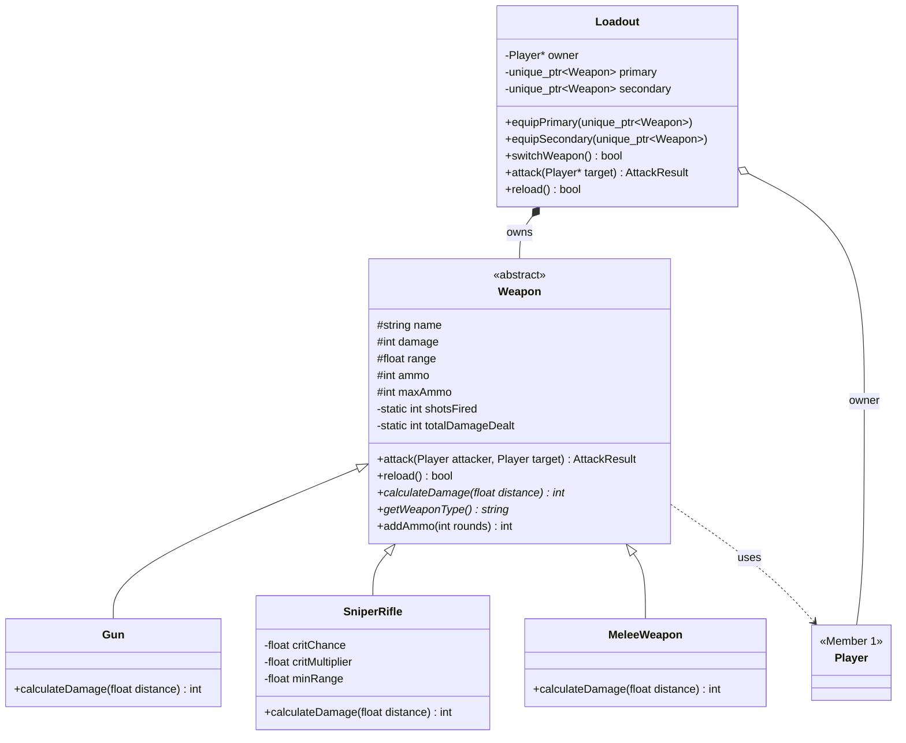

# Weapons & Combat Module (Member 2)

Part of the Battle Royale Game Engine (C++17). Requires Member 1's Player module (`include/player/`, `src/player/`, `PlayerLib`) to be in the repo.

## Files

| File | Purpose |
|------|---------|
| `include/weapon/Weapon.h`, `src/weapon/Weapon.cpp` | Abstract base class and `AttackResult` struct |
| `include/weapon/Gun.h`, `src/weapon/Gun.cpp` | Normal firearm (rifle or pistol), damage falls off with distance |
| `include/weapon/SniperRifle.h`, `src/weapon/SniperRifle.cpp` | Long range, critical hits, weak at close range |
| `include/weapon/MeleeWeapon.h`, `src/weapon/MeleeWeapon.cpp` | No ammo, very short range |
| `include/weapon/Loadout.h`, `src/weapon/Loadout.cpp` | Primary and secondary weapon of a player |
| `tests/weapon_tests.cpp` | Unit tests |
| `tests/weapons_demo.cpp` | Demo for the presentation |
| `WeaponModule.cmake` | Build targets for this module |

## Add to the shared repo

1. Copy these files into the repo root (all are new files).
2. Add this line to the root `CMakeLists.txt`, after the `PlayerLib` section:
   ```cmake
   include(WeaponModule.cmake)
   ```
3. Build and run:
   ```bash
   cmake -S . -B build
   cmake --build build
   ctest --test-dir build --output-on-failure
   ./build/weapons_demo
   ```

## Class diagram



## Weapons

| Weapon | Damage | Range | Ammo | Behaviour |
|--------|--------|-------|------|-----------|
| Gun (rifle: 20, pistol: 15) | 15-20 | 30-60 | 12-30 | Full damage to half range, then drops to 50% at max range |
| Sniper Rifle | 60 | 150 | 5 | 20% crit chance (x1.5), only 40% damage under 20 range |
| Melee (knife, axe) | 35-40 | 2-2.5 | none | Constant damage, no reload |

## OOP concepts used

| Concept | Where |
|---------|-------|
| Abstraction | `Weapon` is abstract: `calculateDamage()` and `getWeaponType()` are pure virtual |
| Encapsulation | Data is protected; accessed through getters; ammo and crit chance are kept in valid ranges |
| Inheritance | `Gun`, `SniperRifle`, `MeleeWeapon` derive from `Weapon` |
| Runtime polymorphism | `Weapon::attack()` calls the virtual `calculateDamage()`, so each weapon deals damage its own way |
| Composition | `Loadout` owns its weapons (`unique_ptr`) and they are destroyed with it |
| Association | `Loadout` only points to its `Player` owner and never deletes it |
| Static members | `shotsFired` and `totalDamageDealt` are shared by all weapons (for match statistics) |

## Adding a new weapon

Write one new class that derives from `Weapon` and implements `calculateDamage()` and `getWeaponType()`. No existing file changes.

```cpp
class Crossbow : public Weapon {
public:
    Crossbow() : Weapon("Crossbow", 45, 70.0f, 1) {}
    int calculateDamage(float) const override { return damage; }
    std::string getWeaponType() const override { return "Crossbow"; }
};
```

## For other members

- `Weapon::attack()` returns an `AttackResult` (success, damage, distance, eliminated, message).
- Use `Loadout::attack(&target)` and `Loadout::reload()` in the game loop.
- Call `Weapon::setVerbose(false)` to silence weapon messages.
- `Weapon::addAmmo(n)` is for ammo pickups.
- `Weapon::getShotsFired()` and `Weapon::getTotalDamageDealt()` are for match statistics.
