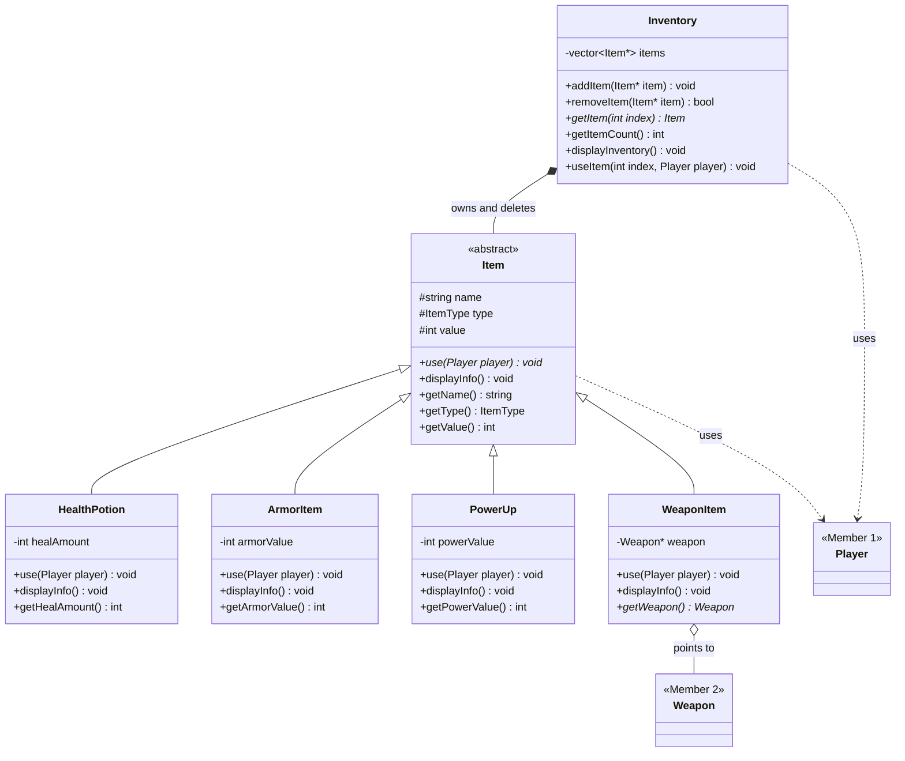

# Inventory, Items & Power-ups Module (Member 3)

Part of the Battle Royale Game Engine (C++17). Requires Member 1's Player module (`include/player/`, `src/player/`, `PlayerLib`) and Member 2's Weapon module (`include/weapon/`, `src/weapon/`, `WeaponLib`) to be in the repo.

## Files

| File | Purpose |
|------|---------|
| `include/item/Item.h`, `src/item/Item.cpp` | Abstract base class and the `ItemType` enum |
| `include/item/HealthPotion.h`, `src/item/HealthPotion.cpp` | Restores player health, never above max health |
| `include/item/ArmorItem.h`, `src/item/ArmorItem.cpp` | Adds shield to the player, never above max shield |
| `include/item/PowerUp.h`, `src/item/PowerUp.cpp` | Power-up item, adds shield to the player, never above max shield |
| `include/item/WeaponItem.h`, `src/item/WeaponItem.cpp` | Holds a pointer to one of Member 2's weapons so it can sit in the inventory |
| `include/item/Inventory.h`, `src/item/Inventory.cpp` | List of items carried by a player |
| `tests/inventory_tests.cpp` | Unit tests |
| `tests/inventory_demo.cpp` | Demo for the presentation |
| `InventoryModule.cmake` | Build targets for this module (`InventoryLib`, `inventory_tests`, `inventory_demo`) |

## Add to the shared repo

1. Copy these files into the repo root (all are new files).
2. Add this line to the root `CMakeLists.txt`, after the `PlayerLib` section and after `include(WeaponModule.cmake)` (`InventoryLib` links to both `PlayerLib` and `WeaponLib`):
   ```cmake
   include(InventoryModule.cmake)
   ```
3. Build and run:
   ```bash
   cmake -S . -B build
   cmake --build build
   ctest --test-dir build --output-on-failure
   ./build/inventory_demo
   ```

## Class diagram



## Items

| Item | Constructor | What `use(player)` does |
|------|-------------|-------------------------|
| `HealthPotion` | `HealthPotion(name, healAmount)` | Adds `healAmount` to the player's health, capped at max health. Prints "Invalid healing amount." and changes nothing if `healAmount <= 0` |
| `ArmorItem` | `ArmorItem(name, armorValue)` | Adds `armorValue` to the player's shield, capped at max shield. Prints "Invalid armor value." and changes nothing if `armorValue <= 0` |
| `PowerUp` | `PowerUp(name, powerValue)` | Adds `powerValue` to the player's shield, capped at max shield. Prints "Invalid power-up value." and changes nothing if `powerValue <= 0` |
| `WeaponItem` | `WeaponItem(name, Weapon*)` | Prints that the player selected the weapon. Prints "no weapon is assigned" if the pointer is `nullptr`. Its `value` is always 0 |

Each item also overrides `displayInfo()`: it prints the common fields (name, value, type) and then its own value (heal amount, armor value, power value, or the weapon's name, damage, range and ammo).

## Inventory

- `addItem(Item*)` stores the pointer; `nullptr` is ignored.
- `removeItem(Item*)` removes the pointer from the list and returns `true`, or `false` if it was not found. It does **not** delete the item, so the caller must delete it.
- `getItem(index)` returns the item, or `nullptr` for an invalid index.
- `useItem(index, player)` calls the item's `use()`. The item stays in the inventory after use. Prints "Invalid inventory item." for an invalid index.
- `displayInventory()` prints a numbered list, or "Inventory is empty."
- The destructor deletes every item still in the inventory, so items must be created with `new` and must not be deleted elsewhere while they are in the inventory.
- `WeaponItem` does **not** own its weapon; the weapon must outlive the item.

## OOP concepts used

| Concept | Where |
|---------|-------|
| Abstraction | `Item` is abstract: `use()` is pure virtual |
| Encapsulation | `name`, `type` and `value` are protected; each item's own value is private; everything is read through getters |
| Inheritance | `HealthPotion`, `ArmorItem`, `PowerUp`, `WeaponItem` derive from `Item` |
| Runtime polymorphism | `Inventory::useItem()` and `displayInventory()` call `use()` and `displayInfo()` through `Item*`, so each item behaves its own way |
| Composition | `Inventory` owns its items and deletes them in its destructor |
| Association | `WeaponItem` only points to a `Weapon` (Member 2) and never deletes it; `use()` and `useItem()` take a `Player&` and do not keep it |
| Enum class | `ItemType` (`Weapon`, `Armor`, `HealthPotion`, `PowerUp`) identifies each item's kind |

## Adding a new item

Write one new class that derives from `Item` and implements `use()`. No existing file changes, except adding the new `.cpp` to `InventoryModule.cmake`. (For a new kind of item, add a value to `ItemType` and a case to `Item::displayInfo()`.)

```cpp
class Grenade : public Item {
public:
    Grenade() : Item("Grenade", ItemType::Weapon, 40) {}
    void use(Player& player) override { /* effect */ }
};
```

## Tests

`tests/inventory_tests.cpp` covers: item basics, health potion (healing, cap at max, invalid value), armor (shield, cap at max, invalid value), weapon item (with and without a weapon), inventory add/get/remove, use and display, item ownership (items are deleted with the inventory; removed items are not), and polymorphism through `Item` pointers.

## For other members

- Use `Inventory::addItem(new ...)` when a player picks up loot and `Inventory::useItem(index, player)` in the game loop.
- Use `Inventory::getItemCount()` and `getItem(i)` to loop over what a player carries.
- `WeaponItem::getWeapon()` returns the `Weapon*` so it can be given to Member 2's `Loadout`. `WeaponItem::use()` only prints the selection; it does not equip the weapon.
