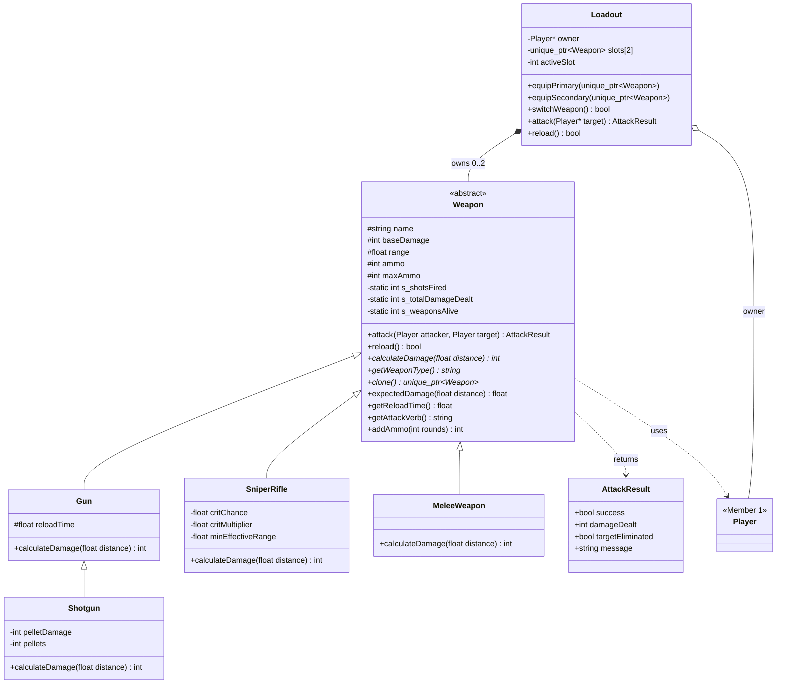

# Weapons & Combat Module (Member 2)

Part of the **Battle Royale Game Engine** OOP group project (C++17).

## 1. What this module provides

| File | Purpose |
|------|---------|
| `include/weapon/Weapon.h`, `src/weapon/Weapon.cpp` | Abstract base class: shared attributes, attack template method, reload, ammo, static statistics |
| `include/weapon/Gun.h`, `src/weapon/Gun.cpp` | Standard firearm (assault rifle / pistol / SMG via constructor args), distance falloff |
| `include/weapon/Shotgun.h`, `src/weapon/Shotgun.cpp` | Extends `Gun`; pellet spread, strong up close, weak far away |
| `include/weapon/SniperRifle.h`, `src/weapon/SniperRifle.cpp` | Long range, critical hits, close-range penalty |
| `include/weapon/MeleeWeapon.h`, `src/weapon/MeleeWeapon.cpp` | No ammo, very short range, constant damage |
| `include/weapon/Loadout.h`, `src/weapon/Loadout.cpp` | Connects players and weapons (composition + association) |
| `include/weapon/AttackResult.h` | Result of an attack, for Game Engine / Event system |
| `tests/weapon_tests.cpp` | 100+ unit checks |
| `examples/weapons_demo.cpp` | Live demo for the presentation |
| `examples/extensibility_demo.cpp` | Adds a new weapon (Crossbow) with zero changes to existing code |
| `experiments/damage_experiment.cpp` | Experimental comparison of weapons |
| `docs/weapons_class_diagram.puml` | PlantUML class diagram (also below in Mermaid) |

## 2. Class diagram



## 3. Weapon behaviour summary

| Weapon | Damage | Range | Magazine | Reload | Special behaviour |
|--------|--------|-------|----------|--------|-------------------|
| Pistol (`Gun`) | 15 | 30 | 12 | 1.0 s | 100% damage up to half range, then falls to 50% |
| Assault Rifle (`Gun`) | 20 | 60 | 30 | 2.0 s | same falloff, longer range |
| Shotgun | 8 pellets x 6 (48) | 15 | 6 | 3.0 s | fewer pellets hit as distance grows (min. 1) |
| Sniper Rifle | 60 | 150 | 5 | 3.5 s | 20% crit chance (x1.5); only 40% damage below 20 m |
| Combat Knife (`MeleeWeapon`) | 35 | 2 | none | n/a | constant damage, no ammo |

## 4. OOP concepts and why they are used

| Concept | Where | Justification |
|---------|-------|---------------|
| **Abstraction** | `Weapon` has pure virtuals `calculateDamage`, `getWeaponType`, `clone` | The engine only needs "something that can attack"; it must not know about specific guns. A generic `Weapon` cannot be instantiated because it has no damage rule of its own. |
| **Encapsulation** | protected/private fields, validated setters (`setAmmo` clamps, `setCritChance` clamps to [0,1], negative damage rejected) | Prevents invalid states such as negative ammo or 250% crit chance. |
| **Inheritance** | `Gun`, `SniperRifle`, `MeleeWeapon` derive from `Weapon`; `Shotgun` derives from `Gun` | Shared attributes and the attack pipeline are written once. `Shotgun` reuses everything from `Gun` and overrides only the damage rule. |
| **Runtime polymorphism** | `attack()` calls virtual `calculateDamage()`, `getAttackVerb()`, `getReloadTime()` via a `Weapon*` | The same call gives different results per real weapon type. `attack()` is a *Template Method*: the fixed algorithm (validate, damage, consume ammo, apply) lives in the base class, and the variable step is a virtual hook. |
| **Composition** | `Loadout` owns its weapons via `std::unique_ptr<Weapon>` | A weapon's lifetime is tied to its carrier; destroying the Loadout destroys its weapons. |
| **Association** | `Loadout` -> `Player*` (owner); `Weapon::attack()` takes `Player&` | Weapons use players but do not own them. |
| **Dynamic objects** | weapons created with `std::make_unique`, stored as `unique_ptr<Weapon>` in vectors and slots | Weapons are created at runtime (loot, pickups) as the base type. |
| **Static members** | `s_weaponsCreated`, `s_weaponsAlive`, `s_shotsFired`, `s_totalDamageDealt`, `s_verbose` | Match-wide statistics that Member 5 can show in the match summary. |
| **Virtual constructor idiom** | `clone()` | Lets Member 3's inventory or loot spawner copy a weapon through a base pointer without slicing. |

## 5. Extensibility (faculty change request)

To add a new weapon you create **one new class** and implement the pure virtuals. Nothing in `Weapon`, `Loadout`, `Player` or the game engine changes.
See `examples/extensibility_demo.cpp` (a `Crossbow` in about 10 lines).

```cpp
class Crossbow : public Weapon {
public:
    Crossbow() : Weapon("Hunter Crossbow", 45, 70.0f, 1) {}
    int calculateDamage(float) const override { return baseDamage; }
    std::string getWeaponType() const override { return "Crossbow"; }
    std::unique_ptr<Weapon> clone() const override { return std::make_unique<Crossbow>(*this); }
    float getReloadTime() const override { return 2.5f; }
    std::string getAttackVerb() const override { return "silently pins"; }
};
```

## 6. Integration guide for teammates

**Member 1 (Player)** - `Player` is unchanged. Two options to connect weapons:
1. *(recommended, zero changes)* keep a `Loadout` per player in the Game Engine: `Loadout loadout(&player);` and call `loadout.attack(&target)`.
2. add `Loadout* loadout;` to `Player` (forward-declare `class Loadout;` like the existing `Inventory*`) and let each player's `attack()` use it, falling back to `baseDamage` if the player is unarmed.

**Member 3 (Inventory/Items)** - `Weapon` is intentionally independent of `Item`. Recommended: create `class WeaponItem : public Item` that owns a `std::unique_ptr<Weapon>` (use `clone()` to spawn copies), and give ammo pickups a call to `weapon->addAmmo(n)`. This avoids multiple inheritance.

**Member 4 (Environment/Events)** - `Weapon::attack()` returns an `AttackResult` with `targetEliminated` and a ready-made `message`, which can feed the event log / kill feed.

**Member 5 (Game Engine)** - use `Loadout::attack()` / `reload()` in the turn loop; `getReloadTime()` can be used as a turn cost. Match statistics: `Weapon::getTotalShotsFired()`, `Weapon::getTotalDamageDealt()`, `Weapon::getWeaponsAlive()`. Call `Weapon::setVerbose(false)` to silence weapon log lines if the engine prints its own.

## 7. Experimental evaluation

Run `./build/damage_experiment` (deterministic; the sniper's 66.0 is 60 damage averaged with its 20% chance of a x1.5 crit).

**Experiment A - expected damage per shot vs distance** (`-` = out of range)

```
Weapon               1m     5m    10m    20m    40m    60m   100m   150m
------------------------------------------------------------------------
Pistol             15.0   15.0   15.0   13.0      -      -      -      -
Assault Rifle      20.0   20.0   20.0   20.0   17.0   10.0      -      -
Shotgun            42.0   30.0   18.0      -      -      -      -      -
Sniper Rifle       26.4   26.4   26.4   66.0   66.0   66.0   66.0   66.0
Combat Knife       35.0      -      -      -      -      -      -      -
```

**Experiment B - shots needed to eliminate a 100 HP target**

```
Weapon                 2m      30m     100m
-------------------------------------------
Pistol                  7       13        -
Assault Rifle           5        5        -
Shotgun                 3        -        -
Sniper Rifle            4        2        2
Combat Knife            3        -        -
```

**Conclusions.** The shotgun wins at very close range but is useless beyond 15 m; the assault rifle is the reliable all-rounder; the sniper dominates beyond 20 m, but up close its damage drops to 26.4 per shot (below the shotgun's 42 and the knife's 35) and its 5-round magazine and 3.5 s reload make it weak in sustained close fights; the knife only works in melee range. This gives the game a rock-paper-scissors feel where the best weapon depends on distance.

## 8. Research comparison: two ways to model weapon behaviour

| | **A. Inheritance hierarchy (used here)** | **B. Data-driven / component based** |
|---|---|---|
| Idea | One subclass per weapon type overriding virtual functions | One generic `Weapon` class configured from data (stats) plus pluggable behaviour components (e.g. falloff, spread, crit) |
| Strengths | Simple, type-safe, easy to explain, compiler enforces the interface, ideal for demonstrating polymorphism | Designers can add weapons without recompiling; behaviours can be mixed freely (e.g. sniper with shotgun spread); avoids deep hierarchies |
| Weaknesses | New behaviour combinations need new classes; hierarchy can get deep and rigid | More indirection and infrastructure; harder to see the polymorphism at a glance |
| Fit for this project | Best for a class-based OOP assignment and the "add a new weapon with minimal changes" requirement | Better for a large production game; could be a proposed improvement |

**Proposed improvement / extension:** replace the hard-coded falloff/crit logic with interchangeable `DamageModel` strategy objects (Strategy pattern), so weapon behaviours can be combined and swapped at runtime, moving from approach A toward approach B without changing the `Weapon` interface.

**References to cite / extend (verify and add your own domain references):**
- R. Nystrom, *Game Programming Patterns* (Component, Type Object, Strategy chapters), https://gameprogrammingpatterns.com
- E. Gamma, R. Helm, R. Johnson, J. Vlissides, *Design Patterns: Elements of Reusable Object-Oriented Software* (Template Method, Strategy, Prototype)

## 9. Limitations

- Positions are 3D points and distance is straight-line; there is no line-of-sight, cover or bullet travel time.
- Hits always land inside range (no accuracy/miss model), except that damage varies with distance and crits.
- Melee has no cooldown or durability.
- `AttackResult::damageDealt` is the damage sent to the target *before* shield absorption; the Player module decides how shield and health absorb it.
- Cloned snipers copy their random-number state, so a clone rolls the same crit sequence until reseeded.

## 10. Viva - likely questions

1. **Why is `Weapon` abstract?** A generic weapon has no damage rule; abstraction forces every concrete weapon to define `calculateDamage`, and lets the engine work with `Weapon*` only.
2. **Where exactly is runtime polymorphism?** `Weapon::attack()` calls the virtual `calculateDamage()`, so `Weapon* w = new SniperRifle; w->attack(...)` uses the sniper's rule. Resolved through the vtable at runtime.
3. **Why is the destructor virtual?** Weapons are deleted through `unique_ptr<Weapon>`; without a virtual destructor derived parts would not be destroyed correctly (undefined behaviour).
4. **Composition vs association here?** `Loadout` *owns* weapons (`unique_ptr`, composition); it merely *knows* its `Player*` owner (association).
5. **What is `clone()` for?** Copying a weapon through a base pointer without slicing (a virtual copy constructor).
6. **How would you add a new weapon?** Write one subclass (see `extensibility_demo.cpp`); no existing file changes.
7. **Why is `Shotgun` derived from `Gun` and not `Weapon`?** It is a kind of gun (magazine, reload, verb) and only the damage rule differs, so it reuses `Gun` (multi-level inheritance).
8. **What are the static members for?** Shared match statistics across all weapon objects (`getTotalShotsFired`, `getWeaponsAlive`, ...).
9. **Why `mutable` in `SniperRifle`?** Rolling a crit advances the random generator, but `calculateDamage` is logically `const`.
10. **Template Method pattern?** The attack algorithm is fixed in `Weapon::attack()`; subclasses only fill in the hooks.
